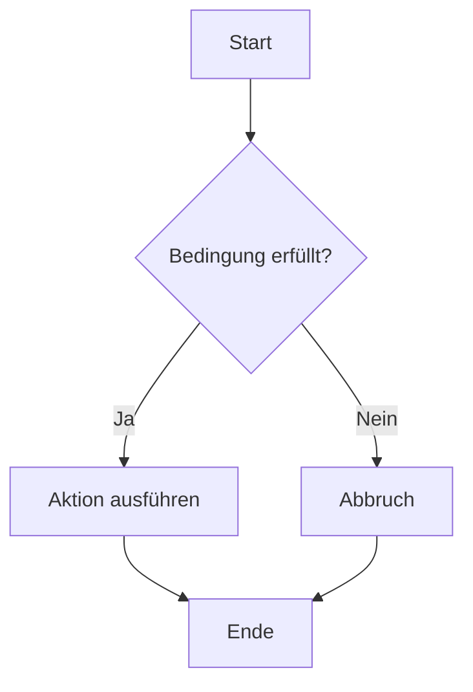
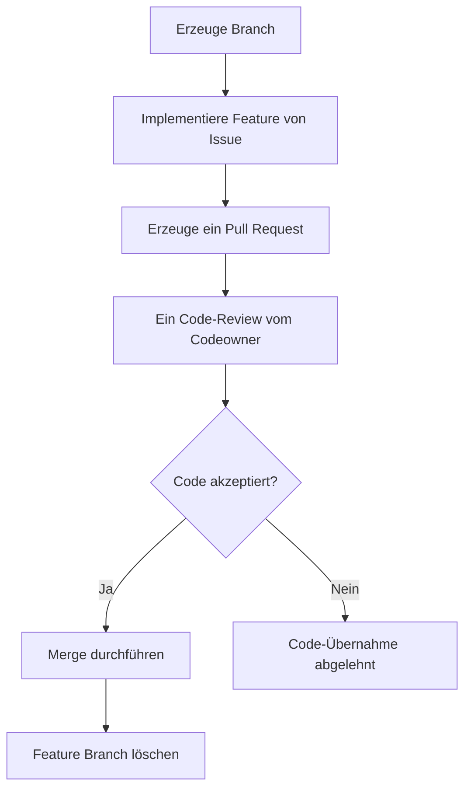

# GitHub Workshop

Lorem ipsum

```csharp
Console.WriteLine("Hello World");
```

```javascript
console.log('Hello World');
```


```mermaid
graph TD
    A[Start] --> B{Bedingung erfüllt?}
    B -->|Ja| C[Aktion ausführen]
    B -->|Nein| D[Abbruch]
    C --> E[Ende]
    D --> E
```


```mermaid
flowchart TD
    A[Erzeuge Branch] --> B[Implementiere Feature von Issue]
    B --> C[Erzeuge ein Pull Request]
    C --> D[Ein Code-Review vom Codeowner]
    D --> E{Code akzeptiert?}
    E -->|Ja| F[Merge durchführen]
    F --> G[Feature Branch löschen]
    E -->|Nein| H[Code-Übernahme abgelehnt]
```
