```mermaid
flowchart TD
    A[Erzeuge Branch] --> B[Implementiere Feature von Issue]
    B --> C[Erzeuge ein Pull Request]
    C --> D[Ein Code-Review vom Codeowner]
    D --> E{Code akzeptiert?}
    E -->|Ja| F[Merge durchführen]
    F --> G[Feature Branch löschen]
    E -->|Nein| H[Code-Übernahme abgelehnt]
```

# GitHub Workshop

Lorem ipsum

<a href="https://www.datev.de">Gehe zu Datev</a>
[Gehe zu Datev](https://www.datev.de)

[🐞 Bug Melden](https://github.com/GregorBiswanger/T-806-Hello-GitHub/issues/new?template=bug_report.md&labels=feature&title=Fehler%20gefunden)


```csharp
Console.WriteLine("Hello World");
```

```javascript
console.log('Hello World');
```



